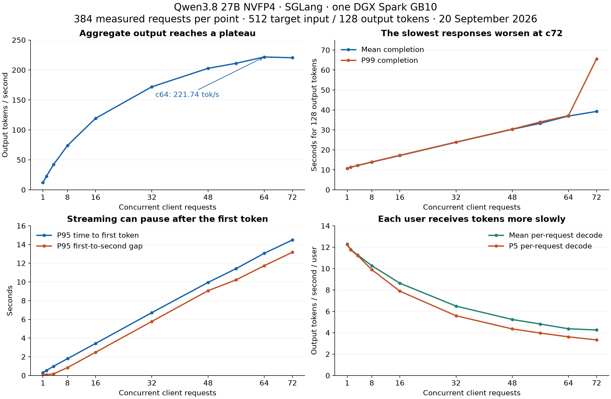

# 2026-09-20T16:28:58Z — Qwen3.8 27B NVFP4 concurrency performance report

Run ID: `RUN-0008`

- Status: resolved (offline analysis completed; the c72 scheduling mechanism remains unconfirmed).
- Phase: analysis of existing inference artifacts; no new benchmark or service change.
- Analysis date: 2026-09-20T16:29:00Z.
- Benchmark window: **2026-09-20 12:47:55–16:12:08 UTC**.
- Related turns: [Full sweep, RUN-0007](2026-09-20T12-47-55Z-aiperf-full-c1-c72.md), [admission setup, RUN-0006](2026-09-20T12-25-45Z-mamba-cache-c72-startup.md), [earlier capacity-limited profile, RUN-0003](2026-09-20T11-29-56Z-aiperf-c72-profile.md).

**For this workload, c4–c8 is the useful range for responsive interaction, c16–c32 trades responsiveness for more completed work, and c48–c64 is suited to throughput-oriented work. c64 had the highest measured output rate, 221.74 tokens/s. c72 added no throughput and introduced much longer waits for a few requests.** These are choices within the tested configuration, conditional on the latency your application can tolerate.

## What was measured

The authoritative comparison is the complete `nvfp4-admission72-full-20260920-21dGW0` sweep in [the original artifact directory](/home/coral/.codex/worktrees/8174/DGXSpark-Small-LLMs/models/qwen3.8-27b-nvfp4/sglang/targets/dgx-spark/artifacts/nvfp4-admission72-full-20260920-21dGW0). Every concurrency used the same server configuration: one NVIDIA GB10 in a DGX Spark; SGLang `0.0.0.dev1+g5f55db35e`; Torch `2.13.0+cu130`; container `dgxspark/qwen3.8-27b-nvfp4-sglang:0.1.0`; 32,768 maximum context; `MAX_RUNNING_REQUESTS=72`; `MAX_MAMBA_CACHE_SIZE=360`; `MEM_FRACTION_STATIC=0.70`; 2,048-token chunked prefill; FP8 KV cache and float32 Mamba state. No active speculative steps were reported by `sglang:spec_num_steps`.

AIPerf `0.12.0` sent streaming chat-completion requests locally, using temperature 0, thinking disabled and `ignore_eos=true`. Each concurrency had **96 warmup requests followed by 384 measured requests**, targeting 512 synthetic input tokens and forcing 128 output tokens. Server usage reports show roughly **524 input tokens per request** (523–526 range), including formatting overhead; every measured response contained exactly 128 output tokens. The recorded tokenizer revision is `482ca0f3832238542f8f5295dde86b5f22711d80`; the run metadata does not independently pin the server's model-weight revision, so it should not be treated as proof of an immutable checkpoint.

All **3,840 measured requests and 960 warmups completed without request errors or cancellation**. Each measured point generated 49,152 output tokens. The entire sweep took about 3 hours 24 minutes including warmup and setup; this is different from per-request latency. At c1 the measurement window alone lasted about 68.1 minutes, versus 3.69 minutes at c64.

Concurrency means simultaneous outstanding requests. It does not mean requests arriving per second or the number of registered users. AIPerf replenished completed requests to maintain the requested load, then drained the final requests. The server's configured admission limit stayed 72 throughout; these results do not measure separately retuned server configurations for each concurrency.

## Reading the results

**Aggregate output throughput** counts generated tokens from all measured requests divided by elapsed benchmark time. At c64, 221.74 output tokens/s corresponds to 1.732 completed 128-token requests/s, or about 104/minute during this workload. It does not mean each user receives 221.74 tokens/s. Input-token throughput and total input-plus-output throughput are different measures and are not substituted for generation speed here.

**Completion latency** is the time from sending a request until its response finishes. **Time to first token (TTFT)** includes waiting for admission, prompt processing and initial response delivery. A P95 latency means about 95% of the observed requests finished that stage within that time; it is an observed percentile, not a future guarantee.

**Per-user decode speed** describes streaming after the first token. AIPerf calculates a request's average inter-token latency as `(completion latency − TTFT) / (output tokens − 1)` and its decode speed as the reciprocal. It includes pauses during the stream but excludes the initial wait. Averaging these per-request reciprocals is different from dividing aggregate throughput by configured concurrency. End-to-end per-user speed also includes TTFT: at c64 it averages about 3.47 tokens/s, versus 4.37 tokens/s for decode alone.

For throughput, the **low percentiles describe the slower requests**. P5 decode speed is useful when assessing whether most users maintain a minimum rate. P95 decode speed describes the fast end; it is not a rate that 95% of users exceeded. A minimum is the slowest request in this sample, not a guaranteed service floor.

## Overall results at every concurrency

| Concurrency | Output tok/s | Requests/s | Mean completion (s) | P95 completion (s) | Mean TTFT (s) | P95 TTFT (s) |
| --- | --- | --- | --- | --- | --- | --- |
| 1 | 12.03 | 0.094 | 10.64 | 10.68 | 0.30 | 0.30 |
| 2 | 22.63 | 0.177 | 11.31 | 11.35 | 0.53 | 0.54 |
| 4 | 41.97 | 0.328 | 12.20 | 12.24 | 0.92 | 0.98 |
| 8 | 73.90 | 0.577 | 13.85 | 13.92 | 1.48 | 1.80 |
| 16 | 119.37 | 0.933 | 17.15 | 17.23 | 2.39 | 3.43 |
| 32 | 171.96 | 1.343 | 23.81 | 23.91 | 4.08 | 6.72 |
| 48 | 202.79 | 1.584 | 30.29 | 30.39 | 5.72 | 9.95 |
| 56 | 211.19 | 1.650 | 33.30 | 33.98 | 6.49 | 11.42 |
| 64 | 221.74 | 1.732 | 36.94 | 37.07 | 7.39 | 13.06 |
| 72 | 220.49 | 1.723 | 39.25 | 40.18 | 8.31 | 14.48 |

**c1 — the latency baseline.** A single active request produces 12.03 output tokens/s overall. The first token arrives in 0.30 seconds and the 128-token response finishes in 10.64 seconds. Decode averages 12.28 tokens/s after the first token. This is the fastest individual experience measured under the fixed server configuration.

**c2 — a large capacity gain for little completion delay.** Aggregate throughput rises 88.1% to 22.63 tokens/s. Mean completion increases only 6.3%, to 11.31 seconds, while TTFT becomes 0.53 seconds. Per-user decode stays close to the single-request rate at 11.79 tokens/s.

**c4 — the highest tested point with P95 TTFT below one second.** Throughput reaches 41.97 tokens/s, 3.49 times c1. Mean completion is 12.20 seconds and P95 TTFT is 0.98 seconds. Decode averages 11.27 tokens/s, with a 11.21 P5. This is the strongest measured choice when quickly starting the answer is a priority.

**c8 — a useful compromise for interactive workloads.** Throughput reaches 73.90 tokens/s, 6.14 times c1, while completion rises to 13.85 seconds. Mean TTFT is 1.48 seconds and P95 TTFT is 1.80 seconds. Decode averages 10.27 tokens/s; P5 is 9.90, so this point does not establish a strict 10-token/s floor. P95 first-to-second response gap is 0.85 seconds.

**c16 — more capacity with visibly longer waits.** Throughput is 119.37 tokens/s, up 61.5% from c8, reaching 53.8% of the measured peak. A response finishes in 17.15 seconds on average; P95 TTFT is 3.43 seconds. Decode averages 8.63 tokens/s, but P5 drops to 7.89. Brief server queues now appear, and the P95 first-to-second gap is 2.48 seconds.

**c32 — stronger throughput, slower interaction.** Throughput reaches 171.96 tokens/s, or 77.5% of the peak, with 23.81-second mean completion. Mean TTFT is 4.08 seconds and P95 is 6.72 seconds. Decode averages 6.49 tokens/s with P5 5.59. Doubling load from c16 adds 44.0% throughput and 38.8% mean completion time. This is the highest tested concurrency whose P5 decode rate exceeds 5 tokens/s.

**c48 — most of the peak throughput.** Output reaches 202.79 tokens/s, 91.5% of c64, while mean completion is 30.29 seconds and P95 TTFT is 9.95 seconds. Decode averages 5.24 tokens/s but P5 is only 4.36. It retains most of the measured capacity with 25% fewer outstanding requests than c64 and about 18.0% shorter mean completion time. It suits queued or background tasks more readily than applications requiring prompt streaming.

**c56 — diminishing gains.** Throughput is 211.19 tokens/s, 95.2% of the peak. Compared with c48, this buys 4.1% more throughput while mean completion rises 9.9% to 33.30 seconds. P95 TTFT is 11.42 seconds and mean decode is 4.81 tokens/s. This is a possible throughput-oriented compromise if reducing latency slightly is worth losing about 4.8% of c64's output rate.

**c64 — the measured throughput peak.** Output reaches 221.74 tokens/s, 18.44 times c1. Mean completion is 36.94 seconds, P95 TTFT is 13.06 seconds, and mean decode is 4.37 tokens/s; P5 is 3.61. It gives the highest completed-work rate and lowest reported GPU energy per output token in this sweep. The latency cost is substantial even though no requests fail.

**c72 — capacity tested, with worse tail latency.** Output is 220.49 tokens/s, 0.6% below c64 despite 12.5% more client concurrency. Mean completion increases to 39.25 seconds, mean TTFT to 8.31 seconds, and P95 TTFT to 14.48 seconds. Mean decode is 4.26 tokens/s and P5 is 3.33. Five measured requests take 62.69–80.07 seconds; that tail makes c72 less attractive than c64 for this workload.

## Streaming smoothness and the slower users

| Concurrency | Mean decode tok/s/user | P5 decode tok/s/user | Minimum decode tok/s/user | Mean ITL (ms) | P95 first-to-second gap (s) |
| --- | --- | --- | --- | --- | --- |
| 1 | 12.28 | 12.23 | 12.05 | 81.41 | 0.08 |
| 2 | 11.79 | 11.74 | 11.74 | 84.85 | 0.09 |
| 4 | 11.27 | 11.21 | 11.15 | 88.77 | 0.17 |
| 8 | 10.27 | 9.90 | 9.87 | 97.42 | 0.85 |
| 16 | 8.63 | 7.89 | 7.85 | 116.27 | 2.48 |
| 32 | 6.49 | 5.59 | 5.56 | 155.42 | 5.78 |
| 48 | 5.24 | 4.36 | 4.34 | 193.44 | 9.06 |
| 56 | 4.81 | 3.97 | 3.87 | 211.11 | 10.22 |
| 64 | 4.37 | 3.61 | 3.53 | 232.68 | 11.73 |
| 72 | 4.26 | 3.33 | 3.26 | 243.62 | 13.16 |

The average ITL alone understates how uneven the stream can feel. At c64 it is 232.68 ms per token, but the **P95 gap between the first and second content responses is 11.73 seconds**. At c72 that gap is 13.16 seconds. A user can see the answer start, then wait a long time for it to continue. AIPerf calls this metric `time_to_second_token`, but its implementation measures the interval from the first content response to the second, rather than elapsed time from the original request.

The exports directly establish these pauses. Competition between prompt processing and decoding under the configured scheduler is a plausible explanation, supported by the queue observations below, but these artifacts do not isolate a specific kernel or scheduling rule. P95 TTFT and P95 first-to-second gaps must not be added to estimate a P95 total: they can belong to different requests.

## Why c72 needs special attention

| Metric | Concurrency 64 | Concurrency 72 |
| --- | --- | --- |
| Aggregate output tok/s | 221.74 | 220.49 |
| Mean completion (s) | 36.94 | 39.25 |
| P95 completion (s) | 37.07 | 40.18 |
| P99 completion (s) | 37.14 | 65.60 |
| Maximum completion (s) | 37.15 | 80.07 |
| P99 first-token wait (s) | 13.30 | 40.92 |
| Mean server queue wait (s) | 5.46 | 6.37 |

The five slow c72 requests are **1.30% of the 384 measured requests**. Each waits roughly 40.91–41.25 seconds for its first token. Four finish around 79.78–80.07 seconds and the last finishes in 62.69 seconds. They occur across successive request waves, rather than being confined to initial startup. The P99 completion value of 65.60 seconds is an interpolated sample quantile across this small tail; it is not the maximum.

The configured server limit was 72, but the measured `sglang:num_running_reqs` maximum and median were **71**, while median queue length was **1**. At c64 the corresponding running maximum was 64 and median queue length was zero. The c72 server queue-time histogram also records five requests waiting more than 30 seconds and no more than 40 seconds. Together these observations are consistent with a request waiting for a running group to finish before admission. They do not by themselves prove why the scheduler stops at 71 in the samples.

This distinction matters: the startup configuration accepted 72, and the load test sustained 72 outstanding client requests, but the sampled telemetry does **not** establish 72 requests simultaneously running. The practical recommendation is c64 over c72 for this measured workload, without claiming that c64 is a statistically proven universal optimum. The 0.6% throughput difference is small enough to require repeated runs before treating it as a reliable performance difference; the observed c72 long waits remain material in this run.

## Server and GPU observations

| Concurrency | Running requests, max | Queued requests, mean / max | GPU temp, mean / max °C | Est. model TFLOPS | GPU J/output token |
| --- | --- | --- | --- | --- | --- |
| 1 | 1 | 0.00 / 0 | 67.2 / 76 | 2.70 | 2.888 |
| 2 | 2 | 0.00 / 0 | 68.4 / 77 | 5.09 | 1.589 |
| 4 | 4 | 0.00 / 0 | 69.5 / 78 | 9.44 | 0.917 |
| 8 | 8 | 0.00 / 0 | 70.9 / 80 | 16.62 | 0.542 |
| 16 | 16 | 0.55 / 8 | 72.5 / 81 | 26.85 | 0.362 |
| 32 | 32 | 2.87 / 24 | 75.4 / 83 | 38.59 | 0.285 |
| 48 | 48 | 5.89 / 40 | 77.5 / 85 | 45.61 | 0.266 |
| 56 | 56 | 7.30 / 48 | 78.8 / 86 | 47.50 | 0.258 |
| 64 | 64 | 9.28 / 56 | 78.9 / 86 | 49.84 | 0.249 |
| 72 | 71 | 10.79 / 64 | 79.9 / 87 | 49.59 | 0.258 |

These telemetry values use **profiling-phase exports**, excluding warmup. Queue lengths are sampled counts; the mean does not mean every request queued. No queued requests were sampled through c8. Queues become visible at c16 and grow at higher load as the server processes arrivals. No request retractions were recorded at any concurrency.

GPU utilization stays near **96% at every point**, including c1. It therefore does not distinguish low-throughput single-request execution from efficient batching in this run. Aggregate throughput rises substantially with concurrency while each request gets slower, consistent with batching doing more total work per unit time. The supplied metrics are insufficient to diagnose a precise memory-bandwidth, compute, or thermal bottleneck.

SGLang's estimated model-operation rate rises from 2.70 to about 49.84 TFLOPS/GPU at c64 and then stays flat. These are model-operation estimates, not measured hardware TFLOPS or a hardware utilization percentage. GPU temperature rises from a 67.2°C average at c1 to 79.9°C at c72, with a maximum of 87°C. The sweep ran sequentially in ascending concurrency, so increasing load and accumulated heat are confounded. The available data does not establish thermal throttling as the cause of the plateau.

AIPerf reports GPU energy falling from **2.888 J/output token at c1 to 0.249 at c64**, an approximately 11.6-fold improvement in output tokens per joule. c72 rises slightly to 0.258 J/token. This includes GPU work for both prompt processing and generation, divided by output tokens; it is not decode-only energy or whole-machine power. Sampled mean GPU power rises from 35.56 W to 58.50 W across c1–c72. The CSV also preserves AIPerf's energy-derived average power separately because it differs from the arithmetic mean of sampled power.

The startup journal records a 360-slot Mamba cache, 228,520 FP8 KV-cache tokens, and 29.76 GB available after graph capture. Those are startup allocations and headroom, not a guarantee of free memory during every workload. The short prompts here do not qualify 72 simultaneous 32K-context requests.

## Relationship to the earlier 72-client run

The `nvfp4-c72-effective33-targeted-20260920-TPefwN` directory is a different server configuration and must not be mixed into this sweep. The earlier memory settings reduced effective admission to 33, with at most 32 running requests observed. It produced 174.46 output tokens/s, a 49.88-second mean completion time, and a 30.41-second mean TTFT.

With the larger Mamba allocation and 0.70 static-memory fraction, the full sweep's c72 point produces **26.4% more aggregate output**, mean completion falls to 39.25 seconds, and mean TTFT falls to 8.31 seconds. Its average decode rate drops from 6.58 to 4.26 tokens/s/user because more requests share generation capacity. That is why a higher decode-only rate in the older run did not mean a faster overall user experience: users spent much longer waiting before decoding began. The earlier aborted full-sweep directory is excluded because it has no completed comparable c1 aggregate.

## Choosing a concurrency policy

Use the following as workload-specific starting points, with limits enforced on outstanding requests where appropriate:

- **P95 first token under 1 second:** c4 is the highest measured point meeting it (0.98 s). Its margin is small.
- **P95 first token under 2 seconds:** c8 is the highest measured point meeting it (1.80 s). It offers 73.90 output tokens/s and about 10.27 decode tokens/s/user on average.
- **P95 first token under 4 seconds:** c16 is the highest measured point meeting it (3.43 s), but streaming pauses already reach 2.48 s at P95.
- **P5 decode speed above 5 tokens/s/user:** c32 is the highest measured point meeting it (5.59), with P95 TTFT 6.72 s.
- **At least 90% of the observed throughput peak:** c48 provides 91.5% with lower latency than c56–c72.
- **Highest measured throughput for background processing:** c64. Its roughly 1.73 requests/s applies specifically to these short prompts and forced 128-token outputs.
- **c72:** useful as a boundary load test; this sweep provides no throughput reason to prefer it over c64.

These are independent criteria, not a combined service guarantee. In particular, fast average decode does not guarantee smooth token delivery or short TTFT. A good interactive policy should constrain TTFT, completion latency, and streaming pauses together. Changing the engine's admission or cache settings would be a new configuration requiring validation; the current report evaluates client concurrency against one fixed configuration.

## Confidence, limitations, and follow-up

This is one sequential synthetic sweep, with one profile per concurrency and no confidence intervals across independent repeats. Seeds vary by concurrency (`42 + concurrency`), so prompts are not identical between points. Request lengths are tightly controlled; the results do not establish quality, reasoning-enabled performance, tool-use or multimodal performance, longer outputs, long-context capacity, burst tolerance, or production reliability.

High-concurrency profiles last only about four minutes and contain roughly five to eight request waves. The final drain matters: 384 is divisible by 64 but not by 56 or 72. Average effective client concurrency was 54.95 at c56 and 67.62 at c72, versus nearly 64 at c64. A partly filled last wave can improve some requests' decode speed while reducing utilization; the c72 P95 decode rate of 6.40 should not be read as generally faster streaming than c64's 5.32. The completed-window aggregate includes these effects.

AIPerf logs contain nonfatal collection warnings: nonfinite `sglang:fwd_occupancy` samples were omitted; API prompt-cache-read counts were unavailable; and the c72 tokenizer-cache metadata read encountered a permission warning. Requests still completed. This report makes no occupancy claim or API cache-efficiency claim. SGLang's sampled prefix-cache hit rate was zero at most points, with a small nonzero observation at c32; that does not establish identical cache conditions between profiles. The artifacts' UTC event timestamps and nanosecond phase boundaries are used for chronology; some human-readable telemetry timestamps are local time.

The next useful measurements are repeated c48/c56/c64/c72 profiles with representative prompt/output lengths, enough duration to reduce fill/drain effects, and varied run order. Inspect server scheduling traces for the repeated c72 admission delay and the long first-to-second response gaps. Choose the final limit against explicit application latency and streaming targets after those measurements.

## Evidence and verification

This report was generated by reading the saved artifacts without sending inference requests or changing the service. Validation checked all ten phase manifests, confirmed 384 measured successes and 96 warmup successes per point, matched mean latency/TTFT/decode metrics against the profiling-only per-request records, checked that every measured output contained 128 server-reported tokens, and confirmed `output tokens/s = requests/s × 128`. Warmup rows in `profile_export.jsonl` were filtered by `metadata.phase_kind == "profiling"`. The aggregate and phase-specific client means agree.

Source files under each `cN/` are `profile_export_aiperf.json`, `profile_export.jsonl`, `phase_manifest.json`, and `phases/profiling/{profile_export_aiperf,server_metrics,gpu_telemetry}.json`. The original run command and runtime details are preserved in RUN-0007 and RUN-0006. Metric formulas were checked against the locally installed AIPerf implementation (`output_token_throughput_metrics.py`, `inter_token_latency_metric.py`, and `ttst_metric.py`).

- [Extracted numeric results (CSV)](2026-09-20T16-28-58Z-concurrency-performance-report/concurrency-metrics.csv)
- [Source file SHA-256 manifest (JSON)](2026-09-20T16-28-58Z-concurrency-performance-report/source-manifest.json)
- [Chart (PNG)](2026-09-20T16-28-58Z-concurrency-performance-report/concurrency-performance.png) · [Chart (SVG)](2026-09-20T16-28-58Z-concurrency-performance-report/concurrency-performance.svg)
- [Original full-sweep artifacts](/home/coral/.codex/worktrees/8174/DGXSpark-Small-LLMs/models/qwen3.8-27b-nvfp4/sglang/targets/dgx-spark/artifacts/nvfp4-admission72-full-20260920-21dGW0)

**Reusable lesson:** select concurrency from the combination of aggregate throughput, low-percentile per-user speed, first-token delay, streaming pauses, and slow-request latency. The largest configured client load can add waiting without increasing completed work.
