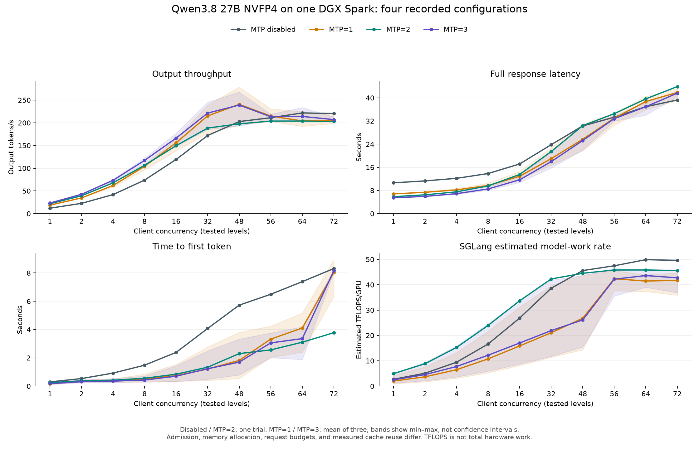
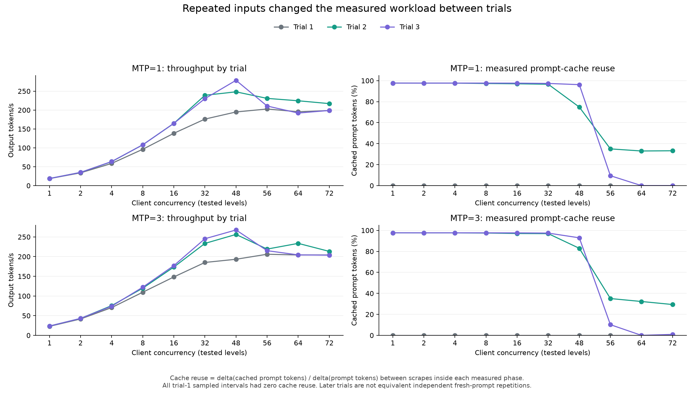

# 2026-09-26T08:06:38Z — Final NVFP4 performance report: MTP disabled, MTP=1, MTP=2, MTP=3

Run ID: `RUN-0026`

- Status: resolved
- Phase: offline analysis of completed experiments; no new inference
- Repo revision: `89611e1`, dirty with experiment documentation
- Host/GPU: DGX Spark, NVIDIA GB10, driver `580.173.02`, aarch64
- Image: `sha256:110ad45e7872397f337ea5714e6c97c400852938a9b8f258bcc27cab07182b0c`
- Engine: SGLang `0.0.0.dev1+g5f55db35e`; AIPerf `0.12.0`, Python 3.12
- Model: `nvidia/Qwen3.8-27B-NVFP4`, revision `482ca0f3832238542f8f5295dde86b5f22711d80`
- Artifacts: [2026-09-26T00-12-44Z-mtp1-mtp3](/home/coral/inference-artifacts/qwen3.8-27b-nvfp4/sglang/dgx-spark/2026-09-26T00-12-44Z-mtp1-mtp3/)
- Related turns: [MTP=2 launch](2026-09-25T20-24-59Z-mtp2-c72-round.md); see this target index for the MTP=1/3 launch and subsequent events.

Derived data, reproducible scripts, and exportable figures: [2026-09-26T08-06-38Z-mtp-disabled-1-2-3-comparison](/home/coral/inference-artifacts/qwen3.8-27b-nvfp4/sglang/dgx-spark/reports/2026-09-26T08-06-38Z-mtp-disabled-1-2-3-comparison/README.md).

**The completed experiments show the strongest MTP benefit at low concurrency.**
MTP=3 had the highest observed average throughput at c1–c32. At c48, MTP=1 and
MTP=3 were effectively tied relative to their trial variation, and their apparent
peaks depended strongly on prompt-cache reuse. At c64–c72, the MTP-disabled
baseline had the highest observed output throughput. The data support choosing
configurations by workload; they do not establish one universal MTP winner.

This is an offline final analysis of **80 successful measured trials and 14,496
requests**, with 128 output tokens in every measured response. All four sweeps
finished without recorded request errors or cancellation. The experiment services
and the 30-minute monitor stopped after completion. No new inference was run for
this report. Earlier failed starts and qualification attempts remain in the journal;
the success count refers to these completed benchmark sweeps.

**The most useful numbers are the observed peaks below.** “Peak” means the largest
recorded per-concurrency value, not a statistically proven optimum. MTP disabled
and MTP=2 have one trial per point; MTP=1 and MTP=3 show arithmetic means of three.

| Configuration | Concurrency at observed peak | Total output tokens/s | Mean response time (s) | SGLang estimated TFLOPS/GPU | Trials per point |
| --- | --- | --- | --- | --- | --- |
| MTP disabled | 64 | 221.74 | 36.94 | 49.89 | 1 |
| MTP=1 | 48 | 240.66 | 25.68 | 26.77 | 3 (different cache conditions) |
| MTP=2 | 64 | 203.80 | 39.64 | 45.84 | 1 |
| MTP=3 | 48 | 239.11 | 25.25 | 26.14 | 3 (different cache conditions) |

**The configurations were not identical except for MTP.** All used the model ID
`nvidia/Qwen3.8-27B-NVFP4`, SGLang `0.0.0.dev1+g5f55db35e`, and AIPerf `0.12.0`
on one NVIDIA GB10 in a DGX Spark. The image tag is
`dgxspark/qwen3.8-27b-nvfp4-sglang:0.1.0`; the MTP rounds pinned image digest
`sha256:110ad45e7872397f337ea5714e6c97c400852938a9b8f258bcc27cab07182b0c`.
The baseline archive does not independently establish an immutable server-weight
revision. All tokenizers, and the MTP target/native-draft weights, use revision
`482ca0f3832238542f8f5295dde86b5f22711d80`. This checkpoint-provenance limitation
is an additional reason to avoid attributing every difference solely to MTP.

| Setting | MTP disabled | MTP=1 | MTP=2 | MTP=3 |
| --- | --- | --- | --- | --- |
| Benchmark date (UTC) | Sep 20 | Sep 26 | Sep 25 | Sep 26 |
| Drafting steps / verification positions | Disabled / N/A | 1 / 2 | 2 / 3 | 3 / 4 |
| Speculative algorithm / top-k | None | EAGLE / 1 | EAGLE / 1 | EAGLE / 1 |
| Effective server admission | 72 | 64 | 72 | 64 |
| Persistent Mamba slots | 360 | 256 | 288 | 256 |
| Mamba cache strategy | extra_buffer | extra_buffer_lazy | extra_buffer_lazy | extra_buffer_lazy |
| Static memory fraction | 0.70 | 0.90 | 0.90 | 0.90 |
| Target KV token capacity at startup | 228,520 | 683,856 | 127,969 | 83,041 |
| Trials per concurrency | 1 | 3 | 1 | 3 |
| Measured requests per trial | 384 | max(64, 3C) | 384 | max(64, 3C) |
| Warmup per concurrency | 96 | max(8, C), trial 1 only | 96 | max(8, C), trial 1 only |
| Total measured requests | 3,840 | 3,408 | 3,840 | 3,408 |

MTP denotes **drafting steps**, as confirmed before launch. MTP=1 predicts one
draft token per round; MTP=3 attempts three, followed by target verification.
All configurations retain float32 Mamba state, FP8 e4m3 KV, 32,768 maximum context,
and 2,048-token chunked prefill. The MTP rounds did not enable ReplaySSM.
MTP=3's larger temporary state motivated admission 64 for both new rounds; at the
same memory fraction, MTP=1 consequently had **8.24×** MTP=3's target KV-token
capacity. Persistent Mamba slots are also a distinct cache resource, so the KV
capacity alone does not explain which prompts remained reusable.

All clients ran locally with streaming chat, temperature 0, thinking disabled,
`ignore_eos=true`, a 512-token synthetic input target and 128 forced output tokens.
Chat formatting adds tokens; the target is not an exact 512-token server prompt.
Seed `42 + concurrency` and the generation policy were retained, but measured
counts and therefore entire prompt corpora were not identical across all rounds.
At large concurrency the new trials have only three client waves; the older
384-request profiles have more. Ramp-up and drain can therefore have different
effects. All are finite-request exploratory profiles, not duration-based soak tests.

**Output throughput at every concurrency** is generated tokens from all measured
requests divided by profile elapsed time. It is not tokens/s for each user.
For MTP=1/3, `±` is the sample standard deviation across three trial values,
not a confidence interval. A single-trial point has no estimated between-run deviation.

| Concurrency | MTP disabled | MTP=1 | MTP=2 | MTP=3 |
| --- | --- | --- | --- | --- |
| 1 | 12.03 | 18.74 ± 0.14 | 21.83 | 23.40 ± 0.43 |
| 2 | 22.63 | 34.64 ± 0.64 | 39.30 | 42.60 ± 0.80 |
| 4 | 41.97 | 62.01 ± 2.81 | 67.78 | 73.39 ± 2.58 |
| 8 | 73.90 | 104.10 ± 6.83 | 106.45 | 117.23 ± 6.75 |
| 16 | 119.37 | 156.07 ± 15.20 | 149.66 | 166.34 ± 15.66 |
| 32 | 171.96 | 215.22 ± 34.12 | 188.43 | 221.38 ± 31.92 |
| 48 | 202.79 | 240.66 ± 42.40 | 197.78 | 239.11 ± 40.08 |
| 56 | 211.19 | 214.84 ± 14.48 | 203.78 | 213.41 ± 6.71 |
| 64 | 221.74 | 204.06 ± 17.88 | 203.80 | 214.05 ± 16.98 |
| 72 | 220.49 | 204.92 ± 10.55 | 203.01 | 207.05 ± 5.39 |

**Mean full-response time** measures request submission to completed response,
including initial waiting and generation. These are means of per-trial means;
each trial at a given concurrency has the same request count. They do not describe
the slowest users, and are not P95/P99 guarantees.

| Concurrency | MTP disabled | MTP=1 | MTP=2 | MTP=3 |
| --- | --- | --- | --- | --- |
| 1 | 10.64 | 6.83 | 5.86 | 5.47 |
| 2 | 11.31 | 7.38 | 6.51 | 5.97 |
| 4 | 12.20 | 8.21 | 7.53 | 6.89 |
| 8 | 13.85 | 9.73 | 9.57 | 8.54 |
| 16 | 17.15 | 12.90 | 13.53 | 11.67 |
| 32 | 23.81 | 18.98 | 21.45 | 17.96 |
| 48 | 30.29 | 25.68 | 30.39 | 25.25 |
| 56 | 33.30 | 32.97 | 34.52 | 32.81 |
| 64 | 36.94 | 38.72 | 39.64 | 36.92 |
| 72 | 39.25 | 41.86 | 43.89 | 41.61 |

**Mean time to first token** describes when the answer begins. It helps distinguish
faster prompt processing from a faster complete response.

| Concurrency | MTP disabled | MTP=1 | MTP=2 | MTP=3 |
| --- | --- | --- | --- | --- |
| 1 | 0.30 | 0.16 | 0.25 | 0.18 |
| 2 | 0.53 | 0.34 | 0.38 | 0.31 |
| 4 | 0.92 | 0.36 | 0.42 | 0.35 |
| 8 | 1.48 | 0.49 | 0.56 | 0.43 |
| 16 | 2.39 | 0.75 | 0.85 | 0.70 |
| 32 | 4.08 | 1.21 | 1.34 | 1.23 |
| 48 | 5.72 | 1.82 | 2.30 | 1.70 |
| 56 | 6.49 | 3.32 | 2.56 | 3.06 |
| 64 | 7.39 | 4.11 | 3.10 | 3.36 |
| 72 | 8.31 | 8.02 | 3.78 | 8.16 |

**SGLang estimated TFLOPS/GPU** was recomputed for every trial with one common
method: the counter increase between the first and last scrapes strictly inside
the measured request window, divided by that scrape interval and `1e12`. Warmup
is excluded. Counter resets were checked; scrape endpoints and deltas are saved.

| Concurrency | MTP disabled | MTP=1 | MTP=2 | MTP=3 |
| --- | --- | --- | --- | --- |
| 1 | 2.70 | 2.00 | 4.91 | 2.50 |
| 2 | 5.09 | 3.68 | 8.84 | 4.54 |
| 4 | 9.44 | 6.48 | 15.26 | 7.75 |
| 8 | 16.62 | 10.75 | 23.96 | 12.21 |
| 16 | 26.85 | 15.86 | 33.68 | 17.02 |
| 32 | 38.62 | 21.06 | 42.29 | 21.90 |
| 48 | 45.60 | 26.77 | 44.53 | 26.14 |
| 56 | 47.49 | 42.37 | 45.83 | 42.19 |
| 64 | 49.89 | 41.47 | 45.84 | 43.63 |
| 72 | 49.63 | 41.73 | 45.59 | 42.73 |

The historical baseline report used AIPerf's profiling-phase rate directly.
Aligning all four configurations to this report's common scrape method changes
some rounding: baseline c64 is **49.89** here versus **49.84** previously. Both
values and the underlying endpoints are retained in the exported trial data;
this is an analysis-window difference, not a new benchmark.

The pinned engine's `scheduler_components/metrics_reporter.py` was inspected and
copied with this report. Its prefill estimate uses the newly processed token
lengths and cached-prefix attention pairs. Its decode counter path uses
`batch_size + num_correct_drafts`, combining accepted draft tokens with the
ordinary/bonus token. That path does not explicitly charge each separate draft
pass or every rejected target-verification position. Consequently, this counter
is a lightweight estimate of model work; it is **not total measured GPU FLOPs,
full speculative-computation cost, or MFU**. Higher TFLOPS does not necessarily
mean faster generation: less cached prompt reuse requires more estimated work.

**Cache reuse materially changes the apparent peak.** Both MTP=1 and MTP=3 reused
the same generated prompts in later trials while preserving native cache state.
The following measurements show why three-trial averages cannot be treated as
three equivalent independent repetitions of a fixed cache condition.

| Configuration | Trial at c48 | Cached prompt fraction | Output tokens/s | Mean response (s) | Estimated TFLOPS/GPU |
| --- | --- | --- | --- | --- | --- |
| MTP=1 | 1 | 0.0% | 194.97 | 31.05 | 43.88 |
| MTP=1 | 2 | 74.8% | 248.25 | 24.33 | 22.13 |
| MTP=1 | 3 | 96.2% | 278.75 | 21.67 | 14.31 |
| MTP=3 | 1 | 0.0% | 193.29 | 30.68 | 43.64 |
| MTP=3 | 2 | 82.9% | 256.35 | 23.07 | 19.35 |
| MTP=3 | 3 | 92.9% | 267.69 | 21.99 | 15.42 |

The cache fraction is `delta(cached_tokens) / delta(prompt_tokens)` over the
sampled measured interval; it is not an average of the periodically updated
cache-hit gauge. In MTP=1, c48 throughput rose from 194.97 to 278.75 tokens/s while
estimated TFLOPS fell from 43.88 to 14.31. MTP=3 shows the same direction. At c64,
trial 2 reused about 33% of prompt tokens for MTP=1 and 32% for MTP=3, while trials1/3
had zero cache hits in the sampled interval. This behavior is consistent with
cache turnover; the saved metrics do not isolate a unique eviction mechanism.

AIPerf's confidence outputs remain available, but their pooled confidence intervals
do not establish stable performance under one cache condition. At c48, MTP=1's
mean exceeds MTP=3's by only **0.65%**, far smaller than the observed variation.
Neither can be declared the reliable winner at that point. Temperature and
scheduling also varied; cache reuse is a demonstrated contributor, not a proof
that it explains every change.

**Looking at the first trial separately reduces the repeated-prompt advantage.**
All MTP=1/3 first-trial sampled intervals had zero cached-prompt counter increase.
The historical baseline and MTP=2 also show zero counter-derived reuse at c48–c72;
at lower concurrency at least one cached-token counter endpoint was unavailable,
so their CSV fractions remain unavailable rather than fabricated as zero. A
cache-hit gauge snapshot does not substitute for this counter-derived fraction.
This table retains the original one-trial points for disabled/MTP=2.

| Concurrency | MTP disabled | MTP=1 | MTP=2 | MTP=3 |
| --- | --- | --- | --- | --- |
| 1 | 12.03 | 18.58 | 21.83 | 22.91 |
| 2 | 22.63 | 33.90 | 39.30 | 41.67 |
| 4 | 41.97 | 58.77 | 67.78 | 70.54 |
| 8 | 73.90 | 96.21 | 106.45 | 109.57 |
| 16 | 119.37 | 138.51 | 149.66 | 148.38 |
| 32 | 171.96 | 176.15 | 188.43 | 185.16 |
| 48 | 202.79 | 194.97 | 197.78 | 193.29 |
| 56 | 211.19 | 202.85 | 203.78 | 206.02 |
| 64 | 221.74 | 195.47 | 203.80 | 204.14 |
| 72 | 220.49 | 198.68 | 203.01 | 204.23 |

This first-trial view is a diagnostic, **not a fully controlled ablation**:
admission, cache allocation, warmup, measurement length, and baseline weight
provenance still differ. It also contains only one trial per point. Nevertheless,
the low-concurrency pattern remains: at c1, first-trial MTP=1/2/3 delivered
18.58/21.83/22.91 output tokens/s versus 12.03 disabled. At c48 all three MTP
first trials were below the 202.79-token/s baseline. The large c48 advantage in
the pooled means therefore does not demonstrate a corresponding advantage on
fresh prompts.

**The concurrency-by-concurrency interpretation is conditional on this workload.**

- **c1:** MTP=3 had the shortest observed full response, 5.47s versus 10.64s disabled.
  Its pooled throughput was 94.6% higher; even the first-trial comparison retained
  a 90.5% advantage. This is the clearest favorable region for speculative decoding.
- **c2:** The observed pooled ordering remains MTP=3, MTP=2, MTP=1, disabled;
  MTP=3 completed responses in 5.97s while serving42.60 output tokens/s.
- **c4:** MTP=3 reached73.39 output tokens/s at 6.89s mean completion. This is a
  useful low-latency candidate within the tested configuration.
- **c8:** MTP=3 reached117.23 tokens/s at 8.54s; disabled reached73.90 at 13.85s.
  The first-trial MTP=3 advantage also persisted here.
- **c16:** MTP=3's pooled mean was166.34 tokens/s, but its first trial was 148.38,
  close to MTP=2's 149.66. Cache condition now affects the ranking materially.
- **c32:** MTP=3 averaged221.38 tokens/s at 17.96s, versus215.22 at 18.98s for
  MTP=1. These retain most of the pooled c48 capacity with shorter responses;
  their first-trial throughputs were185.16 and176.15, respectively.
- **c48:** MTP=1/3's pooled peaks were240.66/239.11 tokens/s, but cache effects
  and variation preclude a strong winner claim. First trials favored the baseline.
- **c56:** All pooled values were near 203–215 tokens/s. MTP=1/3 added substantial
  response time relative to c48 while losing their pooled throughput advantage.
- **c64:** Disabled had the highest observed throughput, 221.74 tokens/s.
  MTP=3 had a similar mean full-response time (36.92s versus 36.94s), but lower
  aggregate output (214.05). Different finite-run/drain behavior can make these
  metrics move differently; output throughput is not simply concurrency/mean latency.
- **c72:** Disabled again had the highest throughput, 220.49 tokens/s. MTP=1/3
  were above their 64-request admission limit. None of the four configurations
  showed a useful observed throughput gain over its own best lower-concurrency point.

**MTP acceptance confirms that the draft head was active.** These ranges are
minimum/maximum per-trial sample means of SGLang's periodic gauges across the
sweep, not exact globally weighted acceptance probabilities. Acceptance length
includes the ordinary/bonus token; acceptance rate concerns proposed draft tokens.

| Configuration | Verification positions | Reported acceptance length | Reported draft acceptance rate |
| --- | --- | --- | --- |
| MTP=1 | 2 | 1.80–1.82 | 79.5–81.7% |
| MTP=2 | 3 | 2.35–2.37 | 67.3–68.4% |
| MTP=3 | 4 | 2.67–2.75 | 55.6–58.4% |

More drafting steps increase accepted tokens per verification round while
reducing the fraction of proposed drafts accepted. Those quantities alone do
not determine speed: the extra drafting, verification, and state allocation
also matter. MTP=1 is therefore a meaningful tested configuration, even though
MTP=3 led the observed low-concurrency throughput here. The disabled sweep
reported speculative steps 0 throughout.

**GPU and queue observations at c64** provide context for the client results.
Values for MTP=1/3 are means of trial sample means; maximum temperature is the
maximum observed across their trials. Queue wait uses histogram sum/count deltas
within the sampled measured interval, so its event cohort can differ slightly
from the client cohort at the boundaries.

| Configuration | Mean GPU utilization | GPU temperature mean / max (°C) | Mean GPU power (W) | Mean server queue wait (s) | Mean TTFT (s) |
| --- | --- | --- | --- | --- | --- |
| MTP disabled | 95.9% | 78.9 / 86 | 56.6 | 5.46 | 7.39 |
| MTP=1 | 95.4% | 72.6 / 81 | 52.9 | 2.22 | 4.11 |
| MTP=2 | 95.8% | 75.1 / 81 | 57.1 | 1.30 | 3.10 |
| MTP=3 | 95.3% | 74.6 / 83 | 57.3 | 1.68 | 3.36 |

GPU utilization near 95–96% does not identify whether batching, memory traffic,
or compute is the limiting factor. The warmer baseline cannot by itself prove
thermal throttling; no clock/throttle diagnosis is established here. These are
device telemetry readings, not whole-system power measurements. Raw supported
energy readings are retained, but this report does not derive a cross-run energy
efficiency claim from them.

Shorter queue/first-token times do not guarantee higher completed-output throughput.
At c64, MTP=2 had lower mean TTFT than disabled while its complete response took
longer on average. Prompt admission and decode throughput are different stages.
All sampled retraction gauges were zero. Some running-request gauge samples in
MTP runs exceed the nominal client concurrency, so those periodic scheduler
gauges are not used as exact counts of simultaneous outstanding client requests.
The effective server admission limits are independently recorded at startup.

**Practical assessment:** MTP=3 is the strongest candidate to validate for
low-concurrency, latency-sensitive requests with this short-output workload.
At c32–c48, use the report as evidence of performance under the recorded cache
mixture; do not present the pooled peak as fresh-prompt capacity. For high-load
fresh-prompt throughput, the MTP-disabled configuration remains a strong candidate
and was the observed leader at c64–c72. MTP=2 provides a substantial observed
low-concurrency gain over disabled, but this dataset establishes no unique region
where its performance reliably dominates all alternatives. MTP=1 has lower draft
depth and a larger KV pool than MTP=3 under this memory budget, while their pooled
c48 results are too close and variable to distinguish reliably.

A clean decision would use the same pinned weights, effective admission, request
budget, repeat count, and declared cache condition for all four modes. Cache
priming or resetting must be verified using measured cache counters; for a cache
reuse comparison, decide whether to match KV capacity as well. Validate candidate
concurrencies such as 4/8 and 32/48/64 under the shared benchmarking rules. These
are follow-up recommendations, not additional experiments started by this report.
No broad quality, tool-use, long-context, or production-capacity claim follows
from synthetic throughput and the limited text/API qualification checks.

**Reproducibility and saved evidence.** The companion directory contains
`trial-metrics.csv`, `trial-metrics.json`, `comparison-summary.json`, the two figures
in PNG/SVG, and the extraction/plot scripts. `source-manifest.json` records SHA-256
hashes for 320 primary input files (four files per trial); 40 additional native
phase summaries supplied the historical-rate reconciliation. JSON contains exact
measurement/scrape boundaries, raw counter deltas, trial variability, telemetry,
and historical phase-rate values. Missing counters remain null. Warmup and
qualification requests are excluded from the 14,496-request total.

Run extraction with `uv run --offline --no-project --python 3.12 analyze-nvfp4-all-mtp.py`;
generate figures/report text with
`uv run --offline --no-project --python 3.12 --with matplotlib python build-nvfp4-mtp-report.py`.
The saved scripts use the source paths below and write to `/tmp/nvfp4-final-mtp-report`;
publication copies the derived files into the unique report archive. The source
benchmark files are unchanged. The offline analysis and source-layout recovery
are recorded in [the preceding journal entry](2026-09-26T08-06-38Z-mtp-comparison-analysis-preflight.md).

Source archives:

- [MTP-disabled full sweep](/home/coral/inference-artifacts/qwen3.8-27b-nvfp4/sglang/dgx-spark/nvfp4-admission72-full-20260920-21dGW0/).
- [MTP=2 full sweep](/home/coral/inference-artifacts/qwen3.8-27b-nvfp4/sglang/dgx-spark/2026-09-25T20-24-59Z-mtp2-c72/README.md).
- [MTP=1 and MTP=3 suite](/home/coral/inference-artifacts/qwen3.8-27b-nvfp4/sglang/dgx-spark/2026-09-26T00-12-44Z-mtp1-mtp3/README.md).
- [MTP=1 cache assessment](2026-09-26T06-54-00Z-mtp1-results-cache-assessment.md).
- [Shared benchmarking rules](../../../../BENCHMARKING.md).
